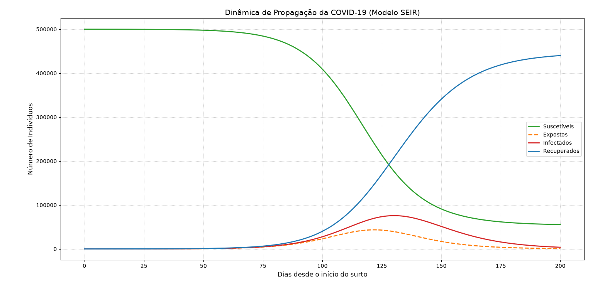

# Modelagem Epidemiológica da COVID-19 com o Modelo SEIR

Simulação computacional da dinâmica de propagação da COVID-19 utilizando o modelo compartimental **SEIR (Susceptíveis, Expostos, Infectados e Recuperados)**, desenvolvida como trabalho final da disciplina **Modelagem Matemático-Computacional Aplicada à Epidemiologia** da **Universidade Federal Rural de Pernambuco (UFRPE)**.

## 📖 Sobre o Projeto

A modelagem epidemiológica é uma ferramenta fundamental para compreender e prever a evolução de doenças infecciosas em populações. Entre os diversos modelos existentes, o modelo **SEIR** destaca-se por incorporar um compartimento de indivíduos **Expostos (E)**, representando o período de incubação da doença antes do surgimento da capacidade de transmissão.

Neste projeto foi implementado um simulador computacional em **Python** capaz de reproduzir a dinâmica temporal da COVID-19 em uma população fechada, permitindo visualizar a evolução dos compartimentos epidemiológicos ao longo do tempo.

## 🦠 O Modelo SEIR

O modelo divide a população em quatro grupos:

* **S (Susceptíveis):** indivíduos que podem contrair a doença.
* **E (Expostos):** indivíduos infectados, mas ainda não infecciosos.
* **I (Infectados):** indivíduos capazes de transmitir a doença.
* **R (Recuperados):** indivíduos recuperados e considerados imunes.

A dinâmica do sistema é descrita pelas seguintes equações diferenciais:

### Equações do Modelo SEIR

```math
\frac{dS}{dt} = -\frac{\beta SI}{N}
```

```math
\frac{dE}{dt} = \frac{\beta SI}{N} - \sigma E
```

```math
\frac{dI}{dt} = \sigma E - \gamma I
```

```math
\frac{dR}{dt} = \gamma I
```

onde:

* **N** representa a população total;
* **β** é a taxa de transmissão;
* **σ** é a taxa de progressão de exposto para infectado;
* **γ** é a taxa de recuperação.

## 🎯 Por que utilizar o modelo SEIR para a COVID-19?

Diferentemente de doenças que apresentam transmissão imediata após a infecção, a COVID-19 possui um período de incubação durante o qual o indivíduo já foi infectado, mas ainda não apresenta capacidade plena de transmissão.

Por essa razão, o modelo SEIR fornece uma representação mais adequada da dinâmica epidemiológica da doença quando comparado ao modelo SIR clássico.

## ⚙️ Parâmetros da Simulação

Os parâmetros utilizados foram:

| Parâmetro                        | Valor    |
| -------------------------------- | -------- |
| População Total (N)              | 500.000  |
| Número Básico de Reprodução (R₀) | 2,5      |
| Tempo Médio de Incubação         | 5,2 dias |
| Tempo Médio de Infecção          | 10 dias  |
| Duração da Simulação             | 200 dias |

## 🚀 Como Executar

### 1. Clonar o repositório

```bash
git clone https://github.com/diegobrnrd/epidemiology-computing.git
cd epidemiology-computing
```

### 2. Criar ambiente virtual (opcional)

```bash
python -m venv venv
```

Ativar:

**Windows**

```bash
venv\Scripts\activate
```

**Linux/macOS**

```bash
source venv/bin/activate
```

### 3. Instalar dependências

```bash
pip install -r requirements.txt
```

### 4. Executar a simulação

```bash
python simulacao_seir_covid.py
```

## 📊 Resultado da Simulação

A execução do código gera um gráfico mostrando a evolução temporal dos compartimentos epidemiológicos.



O comportamento observado reproduz o padrão clássico de uma epidemia sem intervenções:

* Crescimento inicial do número de expostos;
* Atraso no pico de infecções devido ao período de incubação;
* Redução gradual dos suscetíveis;
* Crescimento acumulado dos recuperados;
* Extinção progressiva do surto após a redução de indivíduos suscetíveis.

## 📁 Estrutura do Repositório

```text
epidemiology-computing/
│
├── artigo/
│   └── artigo.pdf
│
├── imagens/
│   └── grafico_seir.png
│
├── prompts/
│   └── prompts_ia.md
│
├── simulacao_seir_covid.py
├── requirements.txt
└── README.md
```

## 📄 Artigo Científico

O artigo científico desenvolvido para o projeto está disponível no repositório:

📄 **[Dinâmica de Propagação da COVID-19: Uma Abordagem Computacional Baseada no Modelo SEIR](./artigo/Dinâmica%20de%20Propagação%20da%20COVID-19%20Uma%20Abordagem%20Computacional%20Baseada%20no%20Modelo%20SEIR.pdf)**

O documento apresenta:

- Fundamentação teórica;
- Formulação matemática do modelo;
- Metodologia computacional;
- Resultados obtidos;
- Discussão das limitações do modelo;
- Referências bibliográficas.

## 🤖 Uso de Inteligência Artificial

Ferramentas de Inteligência Artificial foram utilizadas como apoio durante o desenvolvimento do projeto para:

- Consulta de sintaxe de bibliotecas Python;
- Auxílio na formatação matemática;
- Sugestões de visualização gráfica;

Em conformidade com as orientações da disciplina, os prompts utilizados encontram-se documentados no repositório para fins de transparência acadêmica:

📝 **[PROMPTS_IA.md](./prompts/PROMPTS_IA.md)**

A autoria intelectual do modelo, da análise e das decisões metodológicas permanece sob responsabilidade do autor.

## 📚 Referências

* Anderson, R. M., & May, R. M. *Infectious Diseases of Humans: Dynamics and Control*. Oxford University Press, 1991.
* Brauer, F., Castillo-Chavez, C., & Feng, Z. *Mathematical Models in Epidemiology*. Springer, 2019.

## 👨‍💻 Autor

**Diego Henrique Ferreira Bernardo**

Universidade Federal Rural de Pernambuco (UFRPE)

Projeto desenvolvido para a disciplina **Modelagem Matemático-Computacional Aplicada à Epidemiologia**.
